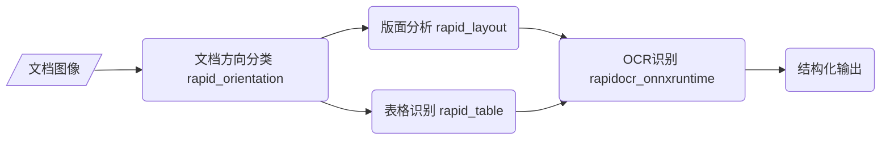

## Rapid Structure

    
    <a href="">=3.6,<=3.11-aff.svg"></a>
    
    
    
    

- 🎉🎉🎉 推出知识星球[RapidAI私享群](https://t.zsxq.com/0duLBZczw)，这里的提问会优先得到回答和支持，也会享受到RapidAI组织后续持续优质的服务，欢迎大家的加入。
- 该部分的功能主要针对文档类图像，包括文档图像分类、版面分析和表格识别。
- 可配套使用项目：[RapidOCR](https://github.com/RapidAI/RapidOCR)

### [文档方向分类](./docs/README_Orientation.md)
### [版面分析](./docs/README_Layout.md)
### [表格识别](./docs/README_Table.md)

### 整体流程

