  

    <h1><b>📃 Rapid Structure</b></h1>
  

<a href="">=3.6,<3.12-aff.svg"></a>

### 简介
> 🎉 推出知识星球[RapidAI私享群](https://t.zsxq.com/0duLBZczw)，这里的提问会优先得到回答和支持，也会享受到RapidAI组织后续持续优质的服务，欢迎大家的加入。

该部分的功能主要针对文档类图像，包括文档图像分类、版面分析和表格识别。

可配套使用项目：[RapidOCR](https://github.com/RapidAI/RapidOCR)

### [文档方向分类](./docs/README_Orientation.md)
### [版面分析](./docs/README_Layout.md)
### [表格识别](./docs/README_Table.md)

### 整体流程

```mermaid
flowchart TD
    A[/文档图像/] --> B([文档方向分类 rapid_orientation]) --> C([版面分析 rapid_layout])
    C --> D([表格识别 rapid_table]) & E([公式识别 rapid_latex_ocr]) & F([文字识别 rapidocr_onnxruntime]) --> G([版面还原])
    G --> H[/结构化输出/]
```

